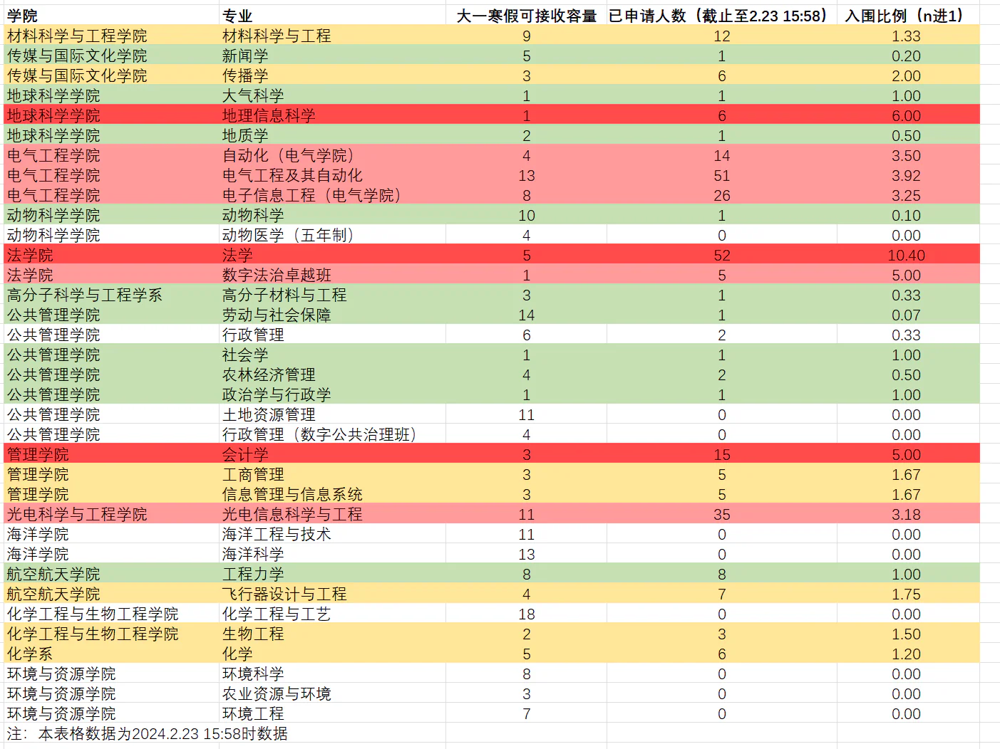
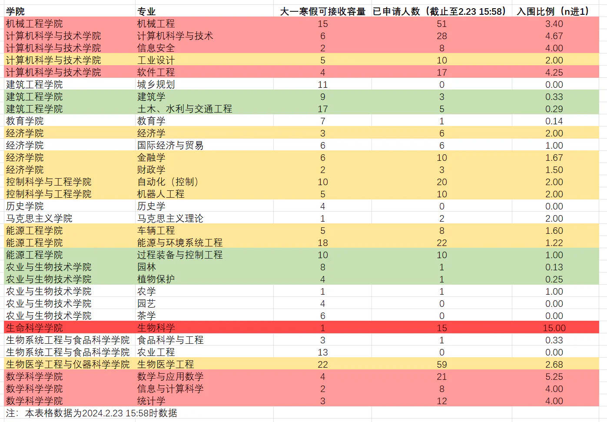
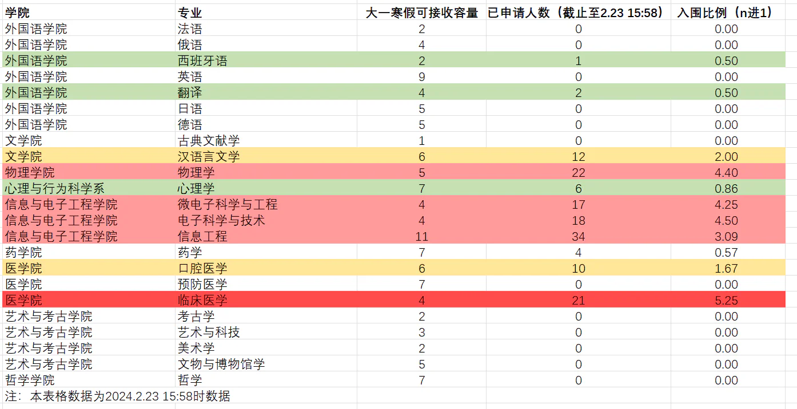

# 大一记事(流水账)

大一一些琐碎的生活切片以及自己的一些想法

## 前言

截至24年6月28日：
po是一位大一结束即将升大二的zju计科平民。回顾过去的一年，有些值得一提的感悟与思考，故而有了这篇文章

## 转专业

po高考发挥失常来了ZJU（非主代码，正常发挥就是主代码水平）。寒假参加选拔进入了竹园，大一下的半期专业确认到计科。这一年来因为专业的不确定经历了不少事情，最后有惊无险确认成功，也算是挽回了一些当年高考的遗憾，遂总结了一些经验供大家参考。

### 转专业战报
ZJU的转专业政策整体相对自由，没有强制要求原专业前百分之多少才能转（部分专业有表刷但要求并不高），加上大一的专业课占比较小，所以建议有想法且成绩尚可的同学都去试一试。（附去年转专业战报）

### 事件节点
***以下是po这届的政策，请同学们及时跟进最新政策***
求是学院：
1.第一轮主修专业确认：只能在招生大类以内确认，如工试，工信
2.第二轮主修专业确认：**可以**跨大类确认，但是对于新高考地区只能**高转低**（只能由录取分高的大类转到录取分低的大类），对老高考地区无高转低限制。
3.寒假转专业：实际上是在大一下学期初转，本次转专业不看高考成绩，主要看大一上绩点与面试表现
后续还有三次假期转专业机会，直到大三上。

竺可桢学院：
1.主修专业确认：大一夏学期
2.转专业：大一暑假，大二寒假，大二暑假共三次转专业机会

竺院主修专业确认规则与*求是学院第二次主修专业确认*政策类似，依然有高转低的限制。不同之处在于竺院学生转专业**不占余量**，这并不意味着可以任转，只是说转专业会更容易些，但具体容易多少不好量化，并且竺院专业确认时间从我们这一届开始延后了（*注：求是科学班除外，求科大一上就确认主修专业，可以参加寒假转专业*），所以有利有弊吧。

### 注意事项
1.选课：
[选课与绩点要求](document/2023级各专业接收学生转专业修读课程及学业基本要求.pdf)
转专业必须满足对应专业的课程与绩点要求，其中H课程可以平替同名的甲/乙课程（i.e.微积分H->微积分甲/乙，但微积分H不能覆盖数学分析）

2.绩点：
上述文件中的绩点只是基本要求，专业竞争越激烈绩点要求越高，所以要量力而行。老师主要看*硬课绩点*（微积分，线性代数，工图，专业课等等）。po是4.8+转的计科。如果你想冲最热门的几个专业那最好硬课全满绩或接近满绩，比较热门的保证硬课4.5+。

3.面试：
考察你对专业的认识与了解。但更重要的是你之前的经历（比如学科竞赛）----我有个工试同学4.8+接近专业第一的绩点转计科没成，不是不够高而是老师似乎只青睐竞赛生……当然我了解到的好像也只是计科这么干，其他专业绩点的权重还是很大的，至于专业知识嘛其实都是可以速成的，尽量给老师留下一个好印象。

### 策略