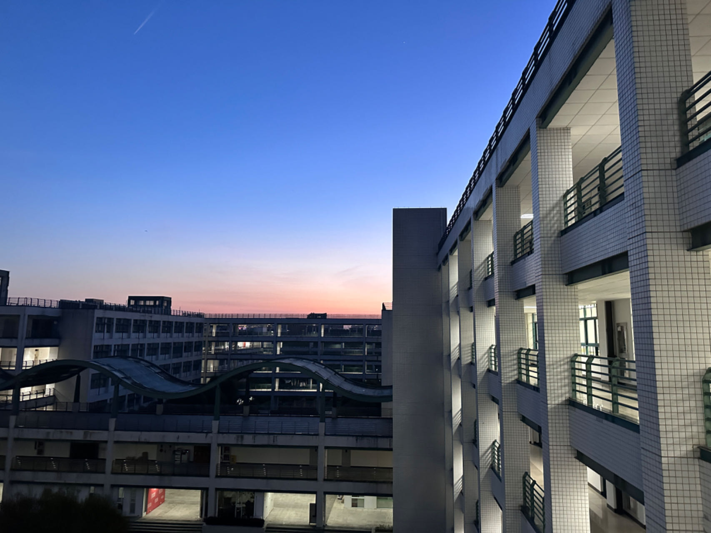

# **My page**

大一一些琐碎的生活切片以及自己的一些想法

不定期掉落一些碎碎念

## **大一下流水账**

截至24年6月28日：
po是一位大一结束即将升大二的zju计科平民。回顾过去的一年，有些值得一提的感悟与思考，故而有了这篇文章


### 转专业

po高考发挥失常来了ZJU（非主代码，正常发挥就是主代码水平）。寒假参加选拔进入了竹院，大一下的半期专业确认到计科。这一年来因为专业的不确定经历了不少事情，最后有惊无险确认成功，也算是挽回了一些当年高考的遗憾，遂总结了一些经验供大家参考。

#### 转专业战报
ZJU的转专业政策整体相对自由，没有强制要求原专业前百分之多少才能转（部分专业有表刷但要求并不高），加上大一的专业课占比较小，所以建议有想法且成绩尚可的同学都去试一试。（附转专业战报）


当然对于新同学而言这张图参考意义不大，如果不了解情况可能会得出不正确的结论，所以仅供参考。

#### 事件节点
***以下是po这届的政策，请同学们及时跟进最新政策***

求是学院：

1.第一轮主修专业确认：只能在招生大类以内确认，如工试，工信
  
2.第二轮主修专业确认：**可以**跨大类确认，但是对于新高考地区只能**高转低**（只能由录取分高的大类转到录取分低的大类），对老高考地区无高转低限制。

3.寒假转专业：实际上是在大一下学期初转，本次转专业不看高考成绩，主要看大一上绩点与面试表现
后续还有三次假期转专业机会，直到大三上。

竹院：

1.主修专业确认：大一夏学期

2.转专业：大一暑假，大二寒假，大二暑假共三次转专业机会

竹院**主修专业确认规则**与*求是学院第二次主修专业确认*政策类似，**依然有高转低的限制**。不同之处在于竹院学生**转专业不占余量**，这并不意味着可以任转，只是说转专业会更容易些，但具体容易多少不好量化，并且竹院专业确认时间从我们这一届开始延后了（*注：求科除外，求科大一上就确认主修专业，可以参加寒假转专业*），所以有利有弊吧。
我觉得两者的区别在于，前者是存量竞争，如果其他同学太厉害就算你也很不错也可能落选；后者是向老师证明自己有能力学好，只要老师能看到你的潜力认为你可以在这个专业学好就会让你进，我了解到的竹院被拒拒大多是绩点不够又想要靠着竹的身份转入而被拒的，不占余量并不是安心躺平的保障。

#### 注意事项
1.选课：
[选课与绩点要求](document/2023级各专业接收学生转专业修读课程及学业基本要求.pdf)
转专业必须满足对应专业的课程与绩点要求，其中H课程可以平替同名的甲/乙课程（i.e.微积分H->微积分甲/乙，但微积分H不能覆盖数学分析）

2.绩点：
上述文件中的绩点只是基本要求，专业竞争越激烈绩点要求越高，所以要量力而行。老师主要看*硬课绩点*（微积分，线性代数，C语言程序设计与实验，工图等，如果是后面三次转专业应该还包含专业课）。po是4.8+转的，如果你想冲最热门的几个专业那最好硬课全满绩或接近满绩，比较热门的保证硬课4.5+。

3.面试：
考察你对专业的认识与了解。但更重要的是你之前的经历（比如学科竞赛），至于专业知识嘛其实都是可以速成的，总之尽量给老师留下一个好印象。

#### 策略：我应该转专业吗？

1.如果你对当前专业比较满意，但想要挑战更好的更心仪的专业，那么建议参加大一寒假的转专业。因为大一上大多数专业的基础课程是重叠的（至少泛工科是这样，但农学，医学，人文类的有较大区别），所以不用刻意调整选课，转专业失败也没什么代价。

2.如果你不是很满意当前专业，下定决心要转或者想转的专业跨度大，专业课重合度低：

首先是选课问题，你可能要大幅调整你的课表选择选择目标专业的课程，比如想去数学那微积分就必须升级为数学分析（这俩难度不在一个量级上），线性代数升级为高等代数（当然如果原专业不学线代那也要把高代选上）

然而随之而来的就是不确定性：如果转不成功，那么你的情况会很被动。你当然可以收获更多的知识（），但功利地讲这些多学的或者更高难度的课就容易成为沉没成本，而且一般情况下转不成功也是因为这些课的成绩不理想阻碍了转专业。此时你要么继续跟着目标专业的培养方案走，要么及时止损选择留在本专业或者选择其他可能的专业。

而且还要特别注意**转专业要求了这些课并不代表你只需要上这些课**，比如[上述文件](document/2023级各专业接收学生转专业修读课程及学业基本要求.pdf)中jk大一暑假转专业课程修读基本要求是4选2，但是如果你4选2的话就只是满足了基本要求，因为jk的正常进度是大一下四门全学完还加一个数字逻辑设计。**真正下定决心转，最好尽可能跟着目标专业的培养方案同步选课**,否则后面的压力会非常大（仅针对没啥基础的同学，大佬请自行忽视）而且面试时老师可能也会考虑你转了后能不能跟上进度，如果选课完全重合老师也更愿意让你来。这么干的风险也蛮大的，所以最好有把握或者下定决心才这么干。

#### 后续发展
转专业成功是一个新的开始，并不代表可以放松了。大一上没有专业课，只要上课认真听了作业认真完成了都可以取得不错的成绩，但大一下三门专业课就有点吃不消了。po是小白，这学期学离散，fds，数逻（*真对不起，没能让数逻大人使出全力……*）加上把下学期的课拿了门到这学期上导致没时间做好准备成绩（数理基础课还好，专业课……）受了影响（算了不为自己开脱了……）

此外，如果是抱着“先转进来再说”的心态，其实是不建议转专业的：你转专业的原因是你喜欢（再降一点吧，至少比起其他更有感觉）这个专业并且付诸行动，而不只是为了拿到一张某个专业的学士学位证书想着以后找工作更有优势。所以对下定决心要转专业的同学，希望你们考虑长远，做好当下与未来的规划，这样对你转专业成功后的发展大有裨益。

#####  一点私货 *这学期在jk的感受*

jk是不错的专业，也是zju的热门专业，但是学业压力与竞争压力都挺大的。

转进来前觉得自己都能扛下来，转进来后发现自己只能扛下来……这学期的期末月非常极限：为了做数逻大程整个端午都献给了从零开始学习VGA,PS2,IP core以及手搓500行代码，连续几天在实验室从早待到晚，终于在6.14做出了个勉强能玩的玩意儿，在此建议大家提早两周开始做大程（如果你准备solo的话）。期末周每科刚好有一天的时间复习（但凡少一天就会爆炸）从早到晚都在东1B的自习室补天……（这些怪我不怪jk，是我之前没做好相应的准备，但也说明在jk养老是不可能的，对于基础薄弱的同学而言更是要努力才可能不掉队）

当然好处是在jk也能见到各种各样的佬，你永远不缺学习榜样，这也是我来jk的原因之一。

最后祝大家都能进入心仪的专业！

（某天黄昏做完数逻lab从实验室出来时拍到的）


## **计算机学科素养速成课程**

### compression
1.有损压缩：一般用于人类感知相关的信息，如图片，音频。正是因为压缩导致电话里的声音与正常的人声有所区别

+合并bit块：不合并例如raw格式，会比JPEG更大

+视频：仅储存变化，用色块的简单运动来描述变化，但是当压缩过度时会出现错误

+去除超声波：人耳无法感知的声音信号

2.无损压缩：

+图片：

游程压缩，通过标记byte数量实现压缩，但有可能压缩后反而变大（图片信息碎片化）

DFTBA：将图片信息整合成更大的块并对块进行编码，注意传输数据时需要将编码与块的对应信息一并传递

### file system

#### menu document

储存文件信息的文件，而一般文件只是储存数据。

including: name, creation time, time of last modification,owner,type(read/write), address

fragmentation/defragmentation;

hierarchical file system:still used today

#### lazy deletion：

删除时并没有真正擦除该位置的文件，只是在目录中删去了文件信息并且在下次写入时可以更改该位置的信息，正因如此某些已经彻底删除的文件仍有可能从电脑中恢复。

### storage

#### hard disk drive 

read and write from magnetic tape

not volatile

#### memory hierarchy

cpu register

cpu cache:import a block of instructions from ram at a time/not committing changes to ram immediately->dirty bits sync

ram

flash/usb memory

hard drives

### OS 

core functionality:kernal  ----in charge of memory management/ I/O control / multitasking

#### kernal protection

once collapsed, you can restart to make it back to normal

#### dynamic memroy allocation

virtual rom

assume that the storage space is consistent in computers

#### memory protection

information of different applications is assigned to different parts to prevent interferences

### IC

from vaccum tubes to transistors

#### PCB

standardized,easy to produce in large scale,helping to connect different parts of computers

#### production

pure sillicon slices,covered by oxide and then covered by a kind of material that will resolve once exposed to light.

steam penetration

### Command line interfaces 
easy to access computers that are faraway

simple but useful

evolve from teletype machines

meet the needs of human-computer interaction

the computers equipped with interactive functions are primitive terminals

defect: not intuitive

### display

two ways to generate pictures: vector scaning and raster scaning 

bit maps are not the original way of representing pictures since they take up much space

the hardpiece which in chargr of transforming from numbers to characters is the original form of GPU

### development of cs during the cold war

the governments paved the way for the development of PC during the cold war

#### development of personal computers

IBM compatible

electronic devices for consumers

### 3D grahics
#### principle

we calculate the position of the object in three dimension space and then project it onto the scree

+ Orthogonal projection

+ perspective projection:two paralell lines will eventually intersect,like our sight

### polygon

we choose triangles to represent a plane because we can not guarantee that four dots are on one plane

numerous triangles construct one 3D object

### **rendering**

#### scanline rendering

the graph is not smooth

#### antialiasing

for pixels on the border, choose the color in between to make it mild to your eyes

#### occlusion relations

+ sorting the polygons first the rendering them from far to close

+ calculating the distances of each pixel first,however when the occluded parts are at the same distances the results are unpredictable(flickering)

#### lighting 

using geometric methods to calculate the brightness of each part to make it 3 dimensionally vivid

#### texture/coloring

the information are stored in ram (gpu ram)

#### outside\inside

we usually calculate outside only

### computer network

#### routing

to decide to where it send data packets

switches: divide the network into smaller parts

#### protocols

IP:IP addresses(computers) and port name(applications). 

UDP:simple(data might lost) however fast

TCP/IP:guarantee that no packets are lost and packets can be sent at one time, but the price is less data can be transmitted at one time

packets have sequence,therefore we can send them simultaneously

ICMP

#### medium

cables: when two signals transmit at the same time it may cause chaos(expotential waiting time to solve conjestion)

wifi:magnetic waves

#### DNS server

translator

if failed:return numbers

eg. 404:the page not found

400~499:error occurred on the client side

#### layers of network


### World Wide Web

#### introduction

different from the internet,www is based on the internet.

internet: lines/tubes

www: an information system that enables content sharing over the internet

#### URL:unified resources locator

helping to locate certain webpage

unique

language:html

#### information transmission protocol

http:only text, no encryption

https:safer

#### browser->searching engine

crawler:finding links

web-rank algorithm

### hackers

attack on SQL: stack overflow

overwrite the info

### Encrption

modern encryption is basd on complexity

#### exchange key

symmetric encryption: one way function makes it possible.We can share the same key without sending it via internet

e.g result :A^x mod B:A,B can be public and the result might be leaked but still hackers don't know the key x(especially when it is a large number)

#### asymmetric encryption

private key is private.public key is public

digital signature is based on it


### ML/CV/NLP

ML is different from AI, it is one foundation of AI.Machines learn by getting close to the right answer.

CV: now using CNN


## **新章节：python学习之CS61A** 

### **basic knowledge**

+very demanding on format:python uses indentation to distinguish between different code-blocks

+object-oriented

+for normal statements,execute it immediately;for functions,store the body waiting to be called

#### terminology

+interpreter:different from compiler,it can execute your code while you are writing,while still you can first write it in your text editor then run it just like C

frame

#### operations

+import lib functions

1.
```python
import math
math.sqrt(4)
```

2.
```python
from math import sqrt
sqrt(4)
```


three different ways to do the division: /,//,%   */ will transform the operand into float automatically,even if the result is an integer*


#### format

no need to declare the variable before using it


function:
```python
def hailstone(digit,num):
    if digit==1:
        print(digit)
        print('the number of steps is:',num)
        return num
    if digit%2==0:
        print(digit)
        hailstone(int(digit/2),num+1)
    if digit%2==1:
        print(digit)
        hailstone(digit*3+1,num+1)
    return None
```


##### input/output


```python
a,b=input().split()   #inputs are all treated as strings,*.split()* helps to divide the inputs,w
print('%s %s'%(a,b))  #no comma in between
```


+all inputs are perceived as strings(),so transformation is needed.

*however when we define a function we don't necessarily need to label the input type,rather it is when we call the function that we need to declare its type*


```python
a,b=map(lambda x:int (x),input('input your data').split()) #format:(the func you choose,input)
```


+for outputs,we can choose one format to output(similar to C except ',')

### basic functions

**many libs provide plenty of functions,which is a great advantage of python**


### **data structure**


